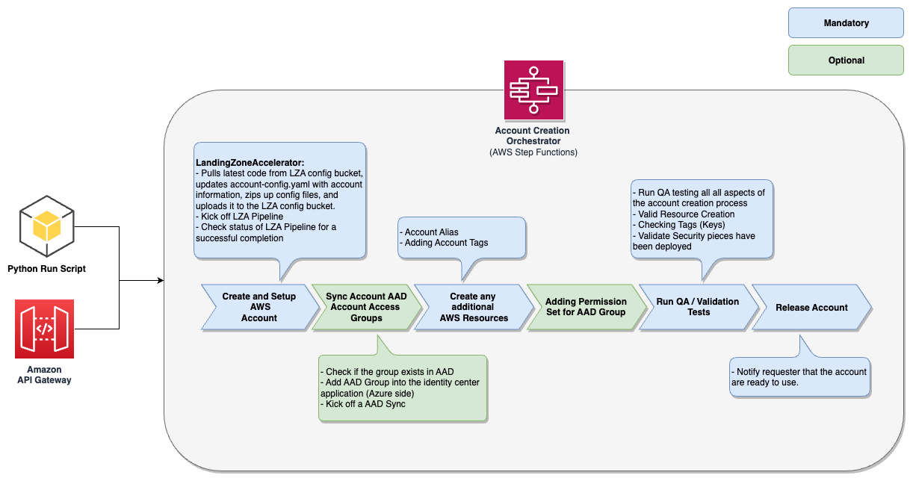
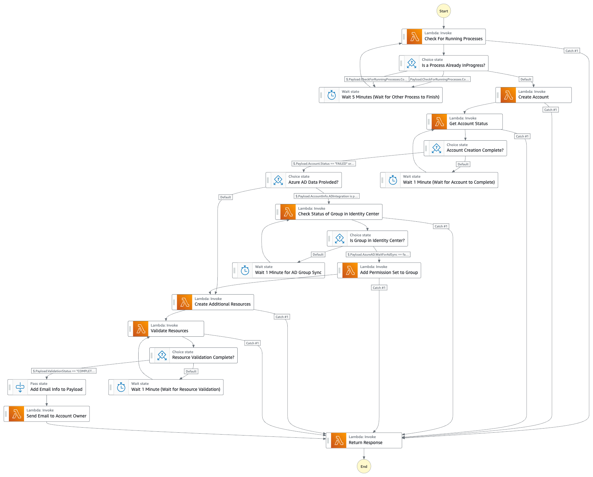

# lza-account-creation-workflow

## Description

This solution enables customers to deploy a new AWS Account using the Landing Zone Accelerator (LZA) solution through a self-service mechanism. It utilizes an AWS Step Function to orchestrate a series of AWS Lambda Functions to add the account information to a Git repository, trigger the LZA CodePipeline, validate the successful creation of all AWS Resources, and send a completion email to the requester.

Optionally, there is a feature that integrates Microsoft Entra ID (Azure Active Directory) groups with permission sets during the account request process. This feature can be enabled in the deploy-config.yaml file.

## Architecture



### Step Function Workflow for Account Creation



### Folder Structure

| Folder/File                                       | Description |
| :------------------------------------------------ | :---------------------------------------------------------------------------------------------------------------------------------------------------------- |
| app                                               | Contains the CDK Application Infrastructure Code (e.g., Lambdas, StepFunctions, SES, S3). |
| app/cdk_helpers           | Directory that holds all definitions used to help deploy and manage the Account Creation solution. |
| app/lambda_layer                                  | Directory that holds all AWS Lambda Layer source code. This code is referenced in more than one Lambda Function. |
| app/lambda_layer/account_creation_helper          | AWS Lambda Layer that contains all common code used across the solution, including modules for assuming roles and checking Service Catalog progress. |
| app/lambda_layer/boto3          | AWS Lambda Layer for the boto3 library, as AWS Lambda doesn't always package the latest version of Boto3. |
| app/lambda_layer/identity_center_helper          | AWS Lambda Layer that supports common AWS IAM Identity Center calls.  |
| app/lambda_src                                    | Directory that holds AWS Lambda Functions source code. |
| app/lambda_src/api          | Directory that holds AWS Lambda Functions used behind AWS API Gateway. |
| app/lambda_src/api/GetExecutionStatus  | AWS Lambda Function that retrieves the status of a running or completed AWS Step Function execution of the Account Creation solution. |
| app/lambda_src/api/NameAvailability  | AWS Lambda Function that checks if an AWS Account Name exists in AWS Organizations. |
| app/lambda_src/api/RunStepFunction  | AWS Lambda Function that runs the Account Creation AWS Step Function. |
| app/lambda_src/event                              | Directory that holds AWS Lambda Functions triggered by an event. |
| app/lambda_src/event/AccountTagToSsmParameter      | AWS Lambda Function that creates an SSM Parameter in the target account based on tags attached to the account within AWS Organizations. The SSM Parameter will be prefixed with "/account/tags/". |
| app/lambda_src/stepfunction                       | Directory that holds AWS Lambda Functions used within the AWS Step Function. |
| app/lambda_src/stepfunction/AttachPermissionSet  | AWS Lambda Function that adds a permissions set to an SSO Group. |
| app/lambda_src/stepfunction/AzureADGroupSync   | AWS Lambda Function that syncs the desired Microsoft Entra ID Group to AWS IAM Identity Center. |
| app/lambda_src/stepfunction/CheckForRunningProcesses   | AWS Lambda Function that checks if the Decommissioning CodeBuild project and LZA Pipeline are currently running. If one of those resources is running, it will delay the AWS Step Function. |
| app/lambda_src/stepfunction/CreateAccount  | AWS Lambda Function that uses LZA to create an AWS Account. |
| app/lambda_src/stepfunction/CreateAdditionalResources  | AWS Lambda Function that creates AWS resources that couldn't be managed by LZA or CloudFormation (e.g., Account Alias, Service Catalog Tags). |
| app/lambda_src/stepfunction/GetAccountStatus  | AWS Lambda Function that scans the AWS Service Catalog Provisioned Product to determine if the account creation has completed. |
| app/lambda_src/stepfunction/ReturnResponse  | AWS Lambda Function that returns either an Account Number (if account creation is successful) or an error message (if there is a failure in the creation process).                                                                                                           |
| app/lambda_src/stepfunction/SendEmailWithSES | AWS Lambda Function that sends out emails to the account requester or team members waiting for the account creation to finish. |
| app/lambda_src/stepfunction/ValidateADGroupSyncToSSO  | AWS Lambda Function that validates the synchronization of the desired Microsoft Entra ID Group to AWS IAM Identity Center. |
| app/lambda_src/stepfunction/ValidateResources | AWS Lambda Function that ensures all Control Tower Customizations have run successfully. |
| app/stepfunction  | Directory that holds the AWS Step Function definitions. |
| configs    | Configuration files used for the solution. |
| configs/deploy-config.yaml  | Configuration file used for deployment and application infrastructure. |
| images | Images used in the README document. |
| pipeline | CDK Deployment Infrastructure Code (e.g., CodePipeline, CodeCommit, CodeBuild). |
| scripts | Supporting scripts to ensure the solution adheres to best practices.  |
| tests | Directory where all testing code should reside.  |
| requirements.txt | Pip requirements file for the deployment environment. |

## Prerequisites

- [Install Landing Zone Accelerator into the Management Account](https://aws.amazon.com/solutions/implementations/landing-zone-accelerator-on-aws/).

- [Install the AWS Cloud Development Kit (CDK)](https://docs.aws.amazon.com/cdk/v2/guide/getting_started.html).

- [Install Docker](https://docs.docker.com/engine/install/) and start the Docker Engine.

- Ensure you have AWS CLI and Console access to the AWS Management Account.
  
  - NOTE: Please read the disclaimer.

- (Optional) Install awscurl [Python](https://pypi.org/project/awscurl/0.6/) [Brew](https://formulae.brew.sh/formula/awscurl)

- (Optional) If you choose to use the Microsoft Entra ID integration, the following steps need to be performed to create an AWS Secret for that integration.

  - [How to get the required data from Microsoft Entra ID](docs/GET_MS_DATA.md)

- (Optional) If you would like to integrate AWS Permissions Sets with a Microsoft Entra ID Group, you will need to create an AWS Secret for GraphAPI.

  - Use the values collected from the previous step to set the variables for the AWS CLI command.

  Example:

  ```bash
  # Variables 
  TENANT_ID='00000000-1111-2222-3333-444444444444'
  CLIENT_ID='55555555-6666-7777-8888-999999999999'
  OBJECT_ID='aaaaaaaa-bbbb-cccc-dddd-eeeeeeeeeeee'
  SECRET_ID='ffffffff-gggg-hhhh-iiii-jjjjjjjjjjjj'
  SECRET_VALUE='****************************************'
  APP_ROLE_ID='kkkkkkkk-llll-mmmm-nnnn-oooooooooooo'
  ENTERPRISE_APP_NAME='AAAA'

  # Creating the Secret
  aws secretsmanager create-secret --name GraphApiSecret --secret-string "{\"client_id\": \"${CLIENT_ID}\", \"tenant_id\": \"${TENANT_ID}\", \"object_id\": \"${OBJECT_ID}\", \"app_role_id\": \"${APP_ROLE_ID}\", \"secret_value\": \"${SECRET_VALUE}\", \"secret_id\": \"${SECRET_ID}\"}"

  # Updating the Secret
  aws secretsmanager update-secret --secret-id GraphApiSecret --secret-string "{\"client_id\": \"${CLIENT_ID}\", \"tenant_id\": \"${TENANT_ID}\", \"object_id\": \"${OBJECT_ID}\", \"app_role_id\": \"${APP_ROLE_ID}\", \"secret_value\": \"${SECRET_VALUE}\", \"secret_id\": \"${SECRET_ID}\"}"
  ```

  - Use LZA to install the three dependent AWS CloudFormation templates located in the dependencies directory.

    - account-creation-validation-role.yaml: This template will be deployed to all AWS Accounts and will provide the Validation Lambda Function with read-only access to the new account. This ensures that the account was provisioned properly.

    - account-tagging-to-ssm-parameter-role.yaml: This template will be deployed to all AWS Accounts and will create an AWS SSM Parameter Store Parameter based on tags stored on the account within AWS Organizations. Each SSM Parameter will be prefixed with "/account/tags/".

    - config-log-validation-role.yaml: This template will be deployed into the LogArchive AWS Account and allow the Validation Lambda Function access to the S3 Bucket and AWS Config rules to ensure they are set up properly.

    - Update the customizations-config.yaml file to deploy the three CloudFormation templates. Below is an example of the new entries for the config file.

    ```yaml
    # customizations-config.yaml
    customizations:
      cloudFormationStacks:
        # --------------------------------------
        # Account Creation / Validation Roles
        # --------------------------------------
        - deploymentTargets:
            organizationalUnits:
              - Root
          description: IAM Role to allow Account Validation
          name: lza-account-creation-validation
          regions:
            - us-east-1
          template: cloudformation/account-creation-validation-role.yaml
          runOrder: 1 
          terminationProtection: true
          parameters:
            - name: pManagementAccountId
              value: "{{ account Management }}"
        - deploymentTargets:
            accounts:
              - LogArchive
          description: IAM Role to validate Config and Logs
          name: lza-config-log-validation-role
          regions:
            - us-east-1
          template: cloudformation/config-log-validation-role.yaml
          runOrder: 1 
          terminationProtection: true          
          parameters:
            - name: pManagementAccountId
              value: "{{ account Management }}"    
        # ---------------------------------
        # Account Tagging to Account SSM
        # ---------------------------------
        - deploymentTargets:
            organizationalUnits:
              - Root
            excludedAccounts:
              - Management
          description: IAM Role to create SSM Parameters based on Account Tagging
          name: lza-account-tagging-to-ssm-parameter
          regions:
            - us-east-1
          template: cloudformation/account-tagging-to-ssm-parameter-role.yaml
          runOrder: 1 
          terminationProtection: true          
          parameters:
            - name: pManagementAccountId
              value: "{{ account Management }}"
    ```

### **DISCLAIMER**

This solution will be deployed into your AWS Management Account. The AWS Management Account is a highly sensitive account that should be protected as much as possible using the least privileged permission model. We recommend that customers use a federated role for access, _NOT_ an IAM user. The required permissions are listed below.

For this example, S3 Bucket Access Logging is not enabled but it is recommended that you enable it when adding this solution to your enterprise.

## Deployment Steps

- Ensure you have access to the AWS Management Account.

- Change directory into the repository directory.

  ```bash
  cd lza-account-creation-workflow
  ```

- Update the config/deploy-config.yaml file with the appropriate values. Typical values that will need updating include: accountCreationFailure, accountCompletionFromEmail, ssoLoginUrl, rootEmailPrefix, rootEmailDomain, useGraphApiSync, and enableAzureADIntegration.

  - To use the optional Microsoft Entra ID integration, you will need to set enableAzureADIntegration to true and ensure that the graphApiSecretName value matches the AWS Secret created in the prerequisite step.

- Ensure that the Docker Engine is running, then run the following CDK commands to deploy the solution's deployment infrastructure. This will set up a CI/CD Pipeline to allow for future enhancements to the solution. It will configure the deployment pipeline and dependent resources (e.g., CodeCommit, CodeBuild, CodePipeline). After the deployment, the Git Repository (CodeCommit) will be populated automatically and trigger the CI/CD Pipeline (CodePipeline). Once the pipeline is complete, the solution will be fully deployed.

  ```bash
  cdk bootstrap
  cdk synth
  cdk deploy
  ```

- _If not deploying into the us-east-1 AWS Region:_ This is needed since AWS Organizations only pushes CloudTrail events to us-east-1. This solution will allow AWS Organizations to push events to other regions using the target event bus.

  - Retrieve the Custom LZA Account Creation Workflow EventBus ARN (oLzaAccountCreationWorkflowEventBusArn) from the _lza-account-creation-workflow-application_ CloudFormation Output.

  - Switch to the us-east-1 AWS Region and run the following command:

  ```bash
  aws cloudformation deploy --stack-name AccountTagToSsmParameterCrossRegionEventRule --template-file dependencies/global-resource-event-rule.yaml --parameter-override pMainEventRuleArn=<<Custom_EventBus_Arn>> --capabilities CAPABILITY_NAMED_IAM
  ```

## How to Run the AWS Step Function

### Arguments

- **account-name** **(-a)** (_string_) -- [REQUIRED]

  The name for the newly managed AWS Account that will be created by AWS Service Catalog / Control Tower.

- **support-dl** **(-s)** (_string_) -- [REQUIRED]

  Support Distribution Email Address for the new AWS Account.

- **managed-org-unit** **(-m)** (_string_) -- [REQUIRED]

  Managed organizational unit. The managed account will be placed under this Organizational Unit.

- **ad-integration** **(-ad)** (_string dictionary_) --

  Microsoft Entra ID Group integration to SSO Permission Sets.
  
  Example:

  ```bash
  --ad-integration [{\"PermissionSetName\":\"CustomerAccountAdmin\",\"ActiveDirectoryGroupName\":\"platform-admin\"}]
  ```

- **account-email** **(-e)** (_string_) --

  The email address used for the root user of the newly managed AWS Account. If this argument isn't used, an email address will be generated using the values _rootEmailPrefix_ and _rootEmailDomain_ from the deploy-config.yaml file.
  
  Example of the generated email address: rootEmailPrefix+awsAccountName@rootEmailDomain.

- **region** **(-r)** (_string_) --

  AWS Region in which the AWS Step Function exists. Default: us-east-1
  
- **force-update** **(-f)** (_string boolean_) --

  This argument will force an update to the AWS Service Catalog Provisioned Product.

- **bypass-creation** **(-b)** (_string boolean_) --

  Skip adding the account to the accounts-config.yaml and skip running the Landing Zone Accelerator CodePipeline. This argument is typically used for testing the Account Creation Workflow process.

- **tags** **(-t)** (_string_) --

  Additional tags to add to the AWS Account. Default Tags: account-name, vendor (aws), product-version, and support-dl.

  Example:

  ```bash
  --tags TEST1=VALUE1 TEST2=VALUE2
  ```
  
### Invoking the AWS Step Function using the provided Python script

- Ensure you have access to the AWS Management Account.

- Change directory into the repository directory.

  ```bash
  cd lza-account-creation-workflow
  ```

- Ensure requirements-run.txt has been installed on the machine where you would like to invoke the AWS Step Function.

  - To install the requirements, run the following command:

    ```bash
    pip install -r requirements-run.txt 
    ```

- Run the following commands to invoke the AWS Step Function:

  ```bash
  python ./run-stepfunction.py \
    --account-name "lza-test-01" \
    --support-dl "johnsmith@example.com" \
    --managed-org-unit "Workloads/Workload-1" \
    --force-update true \
    --ad-integration "[{\"PermissionSetName\":\"CustomerAccountAdmin\",\"ActiveDirectoryGroupName\":\"platform-admin\"}]" \
    --bypass-creation true \
    --tags DeploymentMethod=PythonRunScript Environment=Dev
  ```

### Invoking the AWS Step Function using API Gateway (awscurl)

- The examples below use [awscurl](https://docs.aws.amazon.com/prometheus/latest/userguide/AMP-compatible-APIs.html).

- Retrieve the API Gateway Endpoint from the _lza-account-creation-workflow-application_ CloudFormation output.

  ```bash
  export API_GATEWAY_ENDPOINT=$(aws cloudformation describe-stacks --stack-name "lza-account-creation-workflow-application" --query 'Stacks[*].Outputs[?OutputKey==`oApiGatewayCreateAccountEndpoint`].OutputValue' --output text)
  ```

- Set AWS Region for API calls.
  
  ```bash
  export AWS_REGION=$(aws configure get region)
  ```

- Set AWS Access Key variables. This can be done in a number of ways, the most typical way is copying them from the SSO Access Portal. Then pasting them into a shell.

- Use the API Gateway Endpoint value in the following command to invoke the AWS Step Function.

  ```bash
  awscurl --service execute-api \
    --data @api-example.json \
    --region ${AWS_REGION} \
    --access_key ${AWS_ACCESS_KEY_ID} \
    --secret_key ${AWS_SECRET_ACCESS_KEY} \
    --security_token ${AWS_SESSION_TOKEN} \
    -X POST ${API_GATEWAY_ENDPOINT}execute
  ```

### Check AWS Account Name Availability

The AWS Account Name is available.

```bash
awscurl --service execute-api \
  --region ${AWS_REGION} \
  --access_key ${AWS_ACCESS_KEY_ID} \
  --secret_key ${AWS_SECRET_ACCESS_KEY} \
  --security_token ${AWS_SESSION_TOKEN} \
  -X GET ${API_GATEWAY_ENDPOINT}check_name?account_name=<<AWS_ACCOUNT_NAME>>
```

Result

```bash
null
```

The AWS Account Name is not available

```bash
awscurl --service execute-api \
  --region ${AWS_REGION} \
  --access_key ${AWS_ACCESS_KEY_ID} \
  --secret_key ${AWS_SECRET_ACCESS_KEY} \
  --security_token ${AWS_SESSION_TOKEN} \
  -X GET ${API_GATEWAY_ENDPOINT}check_name?account_name=<<AWS_ACCOUNT_NAME>>
```

Result

```bash
"000000000000"
```

### Check Account Creation Status

Pass

```bash
awscurl --service execute-api \
  --region ${AWS_REGION} \
  --access_key ${AWS_ACCESS_KEY_ID} \
  --secret_key ${AWS_SECRET_ACCESS_KEY} \
  --security_token ${AWS_SESSION_TOKEN} \
  -X GET ${API_GATEWAY_ENDPOINT}get_execution_status?execution=<<STEP_FUNCTION_EXECUTION_NAME>>
```

Pass Result

```bash
# Executon In Progress
{"Status": "RUNNING", "CurrentExecutionTask": "Wait 1 Minute (Wait for Account to Complete)"}

# Execution Completed Successfully
{"Status": "SUCCEEDED"}
```

Failure

```bash
awscurl --service execute-api \
  --region ${AWS_REGION} \
  --access_key ${AWS_ACCESS_KEY_ID} \
  --secret_key ${AWS_SECRET_ACCESS_KEY} \
  --security_token ${AWS_SESSION_TOKEN} \
  -X GET ${API_GATEWAY_ENDPOINT}get_execution_status?execution=<<STEP_FUNCTION_EXECUTION_NAME>>
```

Failure Result

```bash
{"Status": "FAILED", "Cause": "{\"errorMessage\":\"('A task in the account creation step function failed: ', 'The accounts-config.yaml already contains an account with the name of %s and the force update flag is set to False lza2-test-12')\",\"errorType\":\"TypeError\",\"requestId\":\"00000000-1111-2222-3333-444444444444\",\"stackTrace\":[\"  File \\\"/var/task/main.py\\\", line 53, in lambda_handler\\n    raise TypeError(str(e)) from e\\n\"]}"}
```

## Uninstall Solution

1. To remove the AWS CloudFormation Stacks along with the AWS Resources they create, run the following commands:

```bash
aws cloudformation delete-stack --stack-name lza-account-creation-workflow-application
aws cloudformation wait stack-delete-complete --stack-name lza-account-creation-workflow-application
cdk destroy lza-account-creation-workflow-pipeline --force
```

## Troubleshooting

[Troubleshooting](docs/TROUBLESHOOTING.md)
