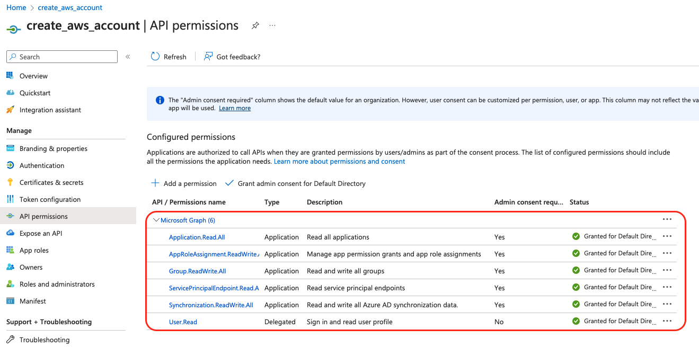
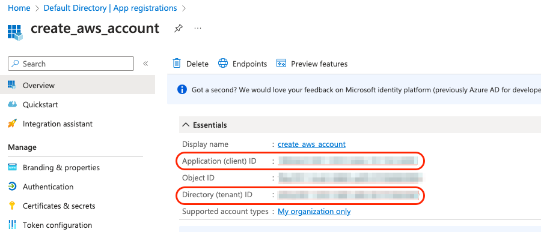
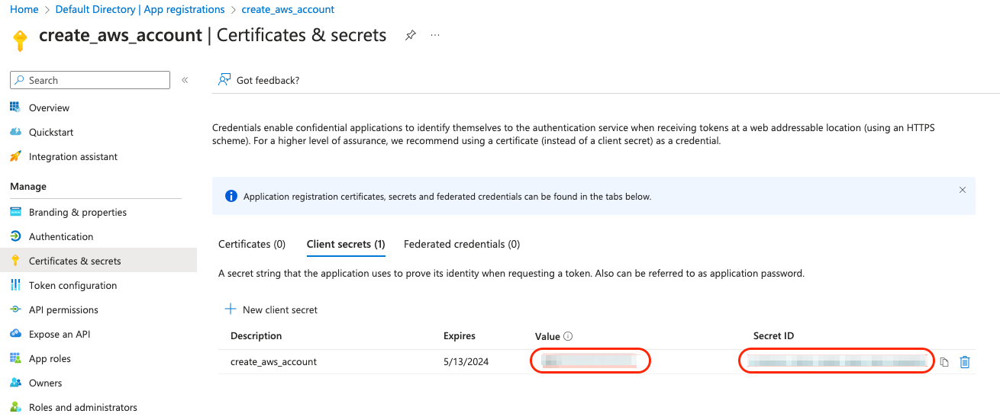
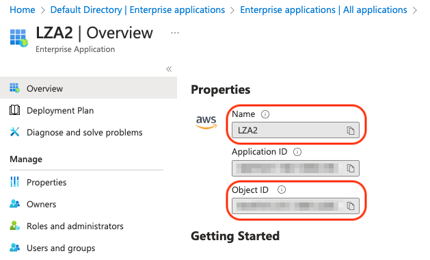
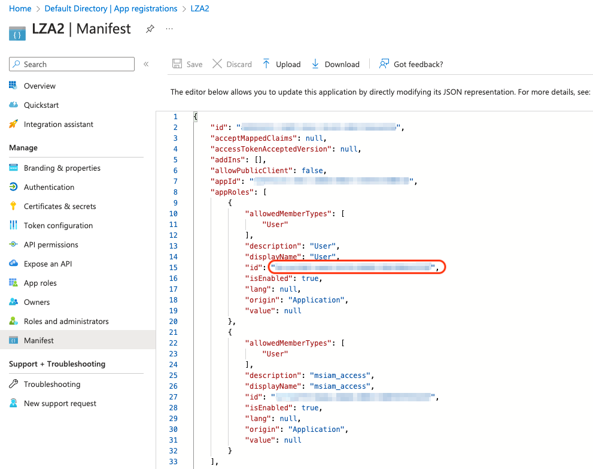

# How to get the required data from Microsoft Entra ID

The following steps are only needed if you intend to use Microsoft Entra ID Groups to link AWS Permissions Sets.  

## Required Steps

There are two Microsoft Entra ID Applications that will be needed to gather data using Graph API.

- An application that is linked to AWS IAM Identity Center. In the screenshots this Application is named *LZA2*.

- An application that will be used by an AWS Lambda Function using Graph API. In the screenshots this Application is named *create_aws_account*.

### Create an Application for the AWS Lambda Function using Graph API

Below are the permissions for the new Microsoft Entra ID Application.



### Requried values

Theses are the vaules need to sync Microsoft Entra ID Groups to AWS IAM Identity Center. Save these values, since they will be used to create an AWS Secret.  

- CLIENT_ID / TENANT_ID

    App registrations > *Application* > Overview

    

- SECRET_ID / SECRET_VALUE

    App registrations > *Application* > Certificates & secrets > Client secrets

    

- ENTERPRISE_APP_NAME / OBJECT_ID

    Enterprise applications > *Application* > Overview

    

- APP_ROLE_ID

    App registrations > *Application* > Manifest

    


<!-- ### Microsoft Entra ID Lambda Integration Required Values

#### Prerequisites

1. An application in Microsoft Entra ID with Graph API permissions listed below.

   - Application.Read.All

   - AppRoleAssignment.ReadWrite.All

   - Group.ReadWrite.All

   - ServicePrincipalEndpoint.Read.All

   - Synchronization.ReadWrite.All

2. A client secret created in the above Azure application for the Lambda to authenticate

3. A secret in secrets manager that contains the following keys
   | Key | Value Location | Description of Value |
   |-----|----------|------------|
   | **ObjectId** | Enterprise Applications | The Object ID of the AWS Identity Center enterprise app in Azure |
   | **AppRoleId** | Enterprise Applications | The ID of the role that users and groups fall under in the AWS Identity Center enterprise app in Azure |
   | **ClientId** | App Registrations | This is the ID of the application from above |
   | **TenantId** | App Registrations | The Azure tenant ID |
   | **SecretValue** | App Registrations > Certificates & secrets | This is the secret Value from step 2 | -->


<!-- ## Additional References

- This is an additional way to get APP_ROLE_ID from Microsoft Entra ID.

```bash
  # Get Bearer Token 
  TOKEN=$(curl -s --location \
    --request POST "https://login.microsoftonline.com/${TENANT_ID}/oauth2/v2.0/token" \
    --header 'Content-Type: application/x-www-form-urlencoded' \
    --data-urlencode "client_id=${CLIENT_ID}" \
    --data-urlencode 'scope=https://graph.microsoft.com/.default' \
    --data-urlencode "client_secret=${SECRET_VALUE}" \
    --data-urlencode 'grant_type=client_credentials' \
    | jq -r '.access_token')

  # Get App_Role Id
  APP_ROLE_ID=$(wget -s -H "Authorization: Bearer ${TOKEN}" \
    "https://graph.microsoft.com/v1.0/applications?$select=displayName,appId,appRoles&$filter=startswith(displayName,\"${ENTERPRISE_APP_NAME}\")" \
    | jq -r ".value[] | select(.displayName==\"${ENTERPRISE_APP_NAME}\") | .appRoles[] | select(.displayName==\"User\") | .id")
``` -->